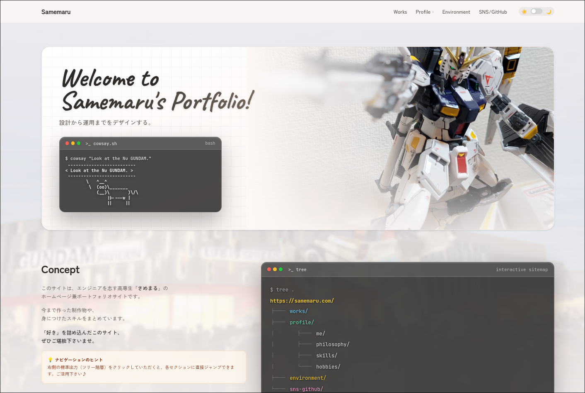

# Samemaru's Portfolio

<div align="center">


[](./LICENSE)

#### >>&nbsp; [Samemaru's Portfolio](https://samemaru.vercel.app)&nbsp; <<

</div>



## 技術スタック

- フレームワーク: [Next.js](https://nextjs.org/)（App Router）
- 開発言語: [TypeScript](https://www.typescriptlang.org/ja/)
- スタイリング: [Tailwind CSS](https://tailwindcss.com/)
- ホスティング: [Vercel](https://vercel.com/)
- パッケージマネージャ: [npm](https://docs.npmjs.com/)

## 設計・実装の工夫点

### UI / UX

- トップの ASCII アート、`tree` 構造リンク、Git コミットグラフなど、CUI をモチーフにした演出を取り入れました。
- Tailwind CSS を活用してダークモードに対応し、画面幅に応じたブラー効果の最適化を行いました。
- 作品詳細モーダルにおいて、縦長プレビューのスクロール表示とヘッダーの追従固定を実装しました。

### 設計・パフォーマンス

- 実績データと UI コンポーネントを分離し、将来的な更新やメンテナンス性を担保しました。
- TypeScript による厳密な型定義を行い、共通 UI パーツの再利用性を高めました。
- `metadataBase` や Next.js Metadata Route を活用し、動的な SEO・OGP 設定を行いました。
- `next/font/google` を採用してアセットを最適化し、レイアウトシフト（CLS）を防止しました。

## ディレクトリ構成

```bash
portfolio/
├ src/
│  ├ app/          # App Router のルーティング・レイアウト・メタデータ
│  ├ components/   # 共通 UI・各セクションコンポーネント
│  ├ data/         # 実績・プロフィール等の表示用データ定義
│  └ types/        # TypeScript 型定義
├ public/
│  ├ images/       # 画像アセット
│  └ og-image.png  # SNS 共有時 OGP 画像
├ CONTRIBUTING.md
├ README.md
└ LICENSE
```

## 開発手順

```bash
# 依存関係のインストール
npm install

# 開発サーバの起動
npm run dev

# ビルド
npm run build
```

MIT License（詳細は [LICENSE](./LICENSE) ファイルを参照）
